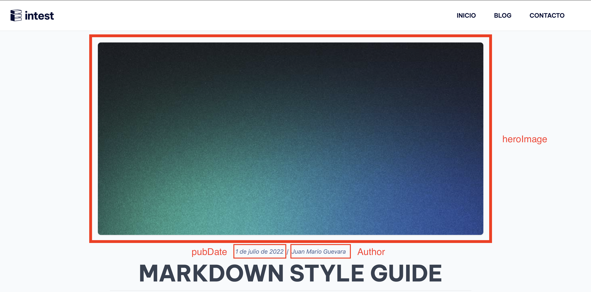

# Intest: manual de uso de la página web

## 👨🏻‍💻 Tecnologias usadas

- [astro: The web framework that scales with you](https://astro.build/).
- [tailwindcss: Rapidly build modern websites without ever leaving your HTML](https://tailwindcss.com/).

## ⬇️ Instalaciones necesarias

- nodeJS v18 o superior: https://nodejs.org/es
- git: https://git-scm.com/downloads.
- Un editor de código, el recomendado es Visual Studio Code: https://code.visualstudio.com/.
- Una terminal de comandos, se recomienda git bash (viene con la instalación de git).

## ⚙️ Configuraciones necesarias

### 1. Configurar llave SSH

Para poder correr el proyecto en tu maquina local es necesario clonar el repositorio desde GitHub, para tal fin es necesario configurar una llave ssh para poder establecer una conexión segura y correr los comandos necesarios vía terminal.

- Guía de como generar una llave ssh en windows: https://docs.github.com/es/authentication/connecting-to-github-with-ssh/generating-a-new-ssh-key-and-adding-it-to-the-ssh-agent
- Guía de como de agregar una llave ssh a Github: https://docs.github.com/es/authentication/connecting-to-github-with-ssh/adding-a-new-ssh-key-to-your-github-account?platform=windows

### 2. Clonar el repositorio

Una vez configurado correctamente git y GitHub el siguiente paso es clonar el repositorio para poder contar con los archivos del proyecto en tu computador.

- Guía para clonar un repositorio: https://docs.github.com/es/repositories/creating-and-managing-repositories/cloning-a-repository?tool=webui

## 📂 Estructura del proyecto

Dentro de la carpeta del proyecto, verás las siguientes carpetas y archivos:

```
/
├── public/
├── src/
│   ├── constanst.ts
│   ├── components
│   ├── content
│   │   └── blog/
│   ├── js
│   ├── styles
│   └── pages/
│       ├── blog/
│       │    ├── [...slug].astro
│       │    └── index.astro
│       └── index.astro
└── package.json
```

## 🚀 Comandos

Todos los comandos se ejecutan desde la raíz del proyecto, desde una terminal:

| Command       | Action                                       |
| :------------ | :------------------------------------------- |
| `npm install` | Para instalar dependencias                   |
| `npm run dev` | Inicia el servidor local en `localhost:4321` |

## 📝 Como agregar post a la web

Para agregar post a la página web necesitamos crear un nuevo archivo markdown (extensión .md) en el folder `src/blog/content`, tenga en cuenta que este archivo debe cumplir con los estándares de una URLs:

- **Caracteres permitidos**: Estos incluyen letras (mayúsculas y minúsculas sin acentos) y números
- **No debe contener espacios en blanco**: En su lugar, puedes usar guiones (-) o guiones bajos (\_) para separar palabras si es necesario.
- **Legibilidad**: Aunque no es una regla estricta, es una buena práctica utilizar nombres de archivo que sean descriptivos y legibles para que los usuarios y que le permitan entender fácilmente el contenido del artículo.

EL nombre del archivo determinará la URL del post ej: `https://integrandoestructuras.com/blog/markdown-style-guide`

### Agregar metadata al post

La metadata de una página web es información adicional que se agrega al código para proporcionar detalles sobre el contenido de la página. La metadata es esencial porque ayuda a los motores de búsqueda a indexar y clasificar el contenido de la página de manera adecuada, lo que a su vez puede afectar la visibilidad de la página en los resultados de búsqueda.

los metadatos así como otros datos que **SI** se muestran en la página se definen como se muestra a continuación:

```md
---
title: 'Markdown Style Guide'
description: 'Here is a sample of some basic Markdown syntax that can be used when writing Markdown content in Astro.'
pubDate: 'Jul 01 2022'
author: 'Juan Mario Guevara'
heroImage: '/blog-placeholder-1.jpg'
published: false
---
```

**NOTA:** todos las variables son obligatorias para que el post funcione de manera correcta.

- **title**: es el título que se le nuestra en los resultados de búsqueda.
- **description**: es el título que se le nuestra en los resultados de búsqueda.
- **pubDate**: Hace referencia a la fecha de publicación del post.
- **author**: hace referencia a quien escribió el post.
- **‌heroImage**: es la imagen de encabezado del post.
- **published**: permite definir si un post aparecerá en la página web (si esta en "false" la publicación no será visible), si se corre la web de forma local por defecto se mostraran todos los post así `published` se haya puesto como false.



### Agregar la imagen de encabezado del post

La imagen de encabezado debe agregarse a la carpeta `/public` esta imagen debe tener 960px de ancho  por 480px de alto, una vez agregada a la carpeta de debe agregar el nombre del archivo a la variable `heroImage` como se muestra en el ejemplo del inciso anterior. Puede tomar como guía el archivo [blog-placeholder-1.jpg](./public/blog-placeholder-1.jpg) que se encuentra en el repositorio.

### Escribir el contenido del post

Para escribir el contendido del post se usa el lenguaje de marcado, el cual facilita la aplicación de formatos al texto a través de caracteres especiales, para consultar la sintaxis puede consultar el post de ejemplo [markdown-style-guide.md](./src/content/blog/markdown-style-guide.md) que se encuentra en el repositorio o consultar el siguiente video: [Markdown, Curso Práctico para principiantes](https://www.youtube.com/watch?v=oxaH9CFpeEE)

### Subir los cambios al repositorio

Para subir y publicar los post al repositorio es necesario utilizar git, a continuación se muestran los comandos necesarios:

```bash
~ git add . #agregar los archivos a git
~ git commit -m"create new post" #crear un commit con los archivos
~ git push origin main #subit los archivos al repositorio
```

**Nota**: se recomienda que el mensaje que se agrega en el comando `git commit` tenga relación con el nombre del post que se publica.

```bash
~ git commit -m"publish markdown-style-guide post"
```
